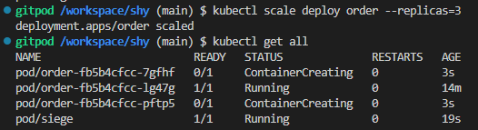
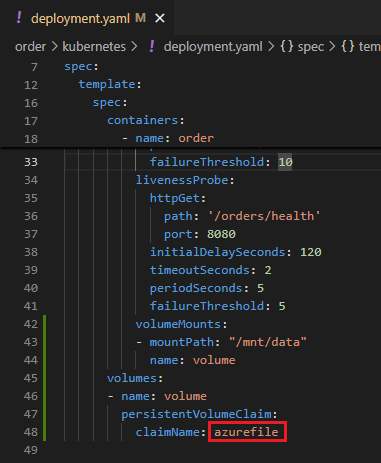
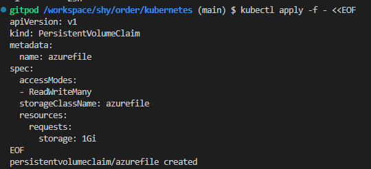
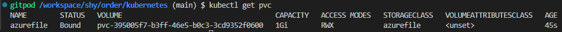
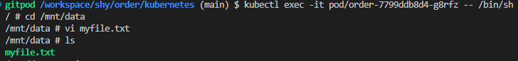
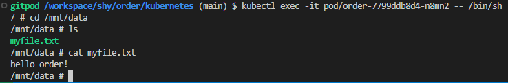
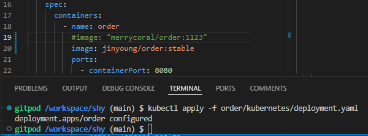

# Final Project

## 시나리오

1. Order 서비스에서 고객이 핸드폰 개통(가입) 한다.

2. Bill 서비스에서 사용월별 청구서가 발행된다.

3. Pay 서비스에서 청구서를 조회한다.

4. 청구금액이 있고 미납 상태이면 요금을 납부한다.

5. 수납 취소를 하면 수납금액이 rollback 된다.

6. MyPage 서비스에서 나의 가입이력, 수납이력을 확인할 수 있다.

## 클라우드 네이티브 아키텍처(IaaS)

### 클라우드 아키텍처 설계


## 클라우드 네이티브 모델링(Biz)

### Data Modeling/서비스 분리/설계 역량

https://www.msaez.io/#/188538207/storming/shy


## 클라우드 네이티브 개발 MSA (Dev)

###  `SAGA-Choreography`

분산 트랜잭션 처리를 위한 Saga Pattern 적용

데이터의 일관성 및 보상처리 가능

Choreography 방식 적용


#### `내 서비스에서의 compensation`


#### 분산 데이터 프로젝션 - CQRS 


## 클라우드 네이티브 운영 (Ops, PaaS)


### 클라우드 배포 역량


#### 클라우드 배포 - Container 운영

##### azure pipeline 설정으로 CI 테스트


소스 repository에 commit이 발생하면 Pipeline trigger가 잘 작동하는지 테스트


방금 커밋한 `608f385` git hash로 build trigger 됨을 확인함.


빌드 후 ACR에 이미지가 올라간 것 확인

##### Pipeline CD 구성


위에서 생성한 Order-CI pipeline을 가지고 CD 구성 후 release 성공함


### 컨테이너 인프라 설계 및 구성 역량

-------------

##### load balancer 설정

order 서비스의 `service.yaml`에 serviceType을 `LoadBalancer` 설정


```

kubectl expose deploy order --type=LoadBalancer --port=8080 --target-port=8080


```

#### 컨테이너 자동확장 - HPA 

order 서비스의 `deployment.yaml`에 resource spec을 설정한다.





부하 주기 전


``` bash
# 부하 load
root@siege:/# siege -c20 -t40S -v http://20.249.197.200:8080/orders
```

부하 준 후


#### 컨테이너로부터 환경분리 - CofigMap/Secret

ConfigMap으로 log level 설정하기

현재 실행중인 서비스의 로그가 `DEBUG` 레벨임을 확인


`config-dev` configMap 객체에 `ORDER_LOG_LEVEL: INFO`로 설정

```YAML
kubectl apply -f - <<EOF
apiVersion: v1
kind: ConfigMap
metadata:
  name: config-dev
  namespace: default
data:
  ORDER_DB_URL: jdbc:mysql://mysql:3306/connectdb1?serverTimezone=Asia/Seoul&useSSL=false
  ORDER_DB_USER: myuser
  ORDER_DB_PASS: mypass
  ORDER_LOG_LEVEL: INFO
EOF
```


```bash
kubectl logs -l app=config
```


서비스의 로그가 `INFO` 레벨임을 확인함.

#### 클라우드스토리지 활용 - PVC 

order서비스의 `deployment.yaml`에 container spec - volume 추가



Persistence Volume Claim - `azureFile` 생성 





이후 order service pod에서 pvc에 접근하여 파일 생성



다른 pod에서도 pvc의 파일이 접근 가능함.



#### 셀프 힐링/무정지배포 - Liveness/Rediness Probe 

##### health check용 간단한 method 생성

OrderContoller.java 내 health check용 method 생성


order/kubernetes/deployment.yaml에 readinessProbe, livenessProbe 설정


실행 중인 order 서비스


```bash
# 부하 load 중
siege -c1 -t60S -v http://order:8080/orders --delay=1S
```

실행 중인 order 서비스의 `deployment.yaml`에 image source를 변경한 후 


siege 테스트 결과 확인 -> Availability 100.00 % 확인 가능.

```
HTTP/1.1 200     0.01 secs:     301 bytes ==> GET  /orders
HTTP/1.1 200     0.01 secs:     301 bytes ==> GET  /orders

Lifting the server siege...
Transactions:                    112 hits
Availability:                 100.00 %
Elapsed time:                  59.04 secs
Data transferred:               0.03 MB
Response time:                  0.01 secs
Transaction rate:               1.90 trans/sec
Throughput:                     0.00 MB/sec
Concurrency:                    0.02
Successful transactions:         112
Failed transactions:               0
Longest transaction:            0.02
Shortest transaction:           0.00
```

`kubectl describe deployments.apps order`


order deploy의 image가 서비스 실행 중 변경한 `jinyoung/order:stable` 임을 확인하였다.

무중단 배포에 성공함

#### 서비스 메쉬 응용 - Mesh 

#### 통합 모니터링 - Loggregation/Monitoring


